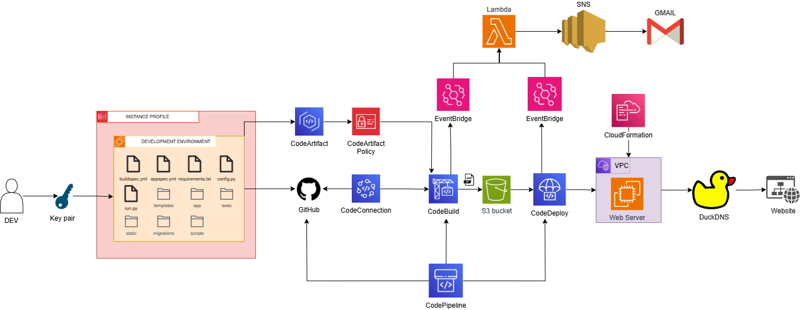

# SaaSight

**SaaSight** is a cloud-native SaaS product feedback and moderation platform. Inspired by real-world tools like G2, Trustpilot, and Capterra, SaaSight enables users to review SaaS tools and allows product managers to monitor, moderate, and manage public sentiment—all backed by production-grade DevOps workflows.

Deployed via a fully automated **CI/CD pipeline on AWS**, the application runs on a secure and scalable infrastructure using **NGINX reverse proxy**, **HTTPS with DuckDNS & Let's Encrypt**, and **EC2-based deployment**.

---

## Features

### Users (General Public)

* Register & log in to explore SaaS tools.
* View product pages with ratings and reviews.
* Submit 1–5 star reviews per product.
* Flag inappropriate reviews.
* View all personal reviews in the user dashboard.

### Managers (Product Owners / Moderators)

* Login with elevated access.
* Add/edit SaaS products.
* Monitor and moderate reviews.
* View flagged reviews in a **Notifications** section.
* Remove flagged or inappropriate reviews.

### Admins (Coming Soon)

* Dashboard to manage users and managers.
* Access analytics and review history.

---

## Use Case

SaaSight is ideal for:

* **SaaS founders** building trust via reviews.
* **Product managers** ensuring feedback hygiene.
* **DevOps engineers** demonstrating cloud CI/CD infrastructure.
* **Students and developers** creating production-grade cloud-native apps.

This project replicates a mini real-world review system backed by a scalable AWS deployment.

---

## Tech Stack

* **Backend**: Python, Flask, SQLAlchemy ORM
* **Frontend**: HTML5, Bootstrap 5, Jinja2 templating
* **Database**: SQLite (dev), can be replaced with PostgreSQL/MySQL
* **Authentication**: Flask-Login, Role-based Access Control (RBAC)
* **Server**: NGINX reverse proxy to Flask app
* **Domain & HTTPS**: DuckDNS custom subdomain + Let's Encrypt

---

## CI/CD Pipeline (AWS)

> SaaSight runs on a full **CI/CD pipeline** built with AWS-native services.

### Architecture:

* **Source**: GitHub
* **CI**: AWS CodeBuild (with Python environment & CodeArtifact integration)
* **Artifact Management**:  S3 bucket for build artifacts
* **CD**: AWS CodeDeploy deploying to EC2 via appspec.yml
* **Infrastructure**: AWS CloudFormation (IaC for provisioning EC2, IAM, S3, CodePipeline, etc.)
* **Reverse Proxy**: NGINX setup on EC2 with HTTPS via DuckDNS & Certbot
* **Monitoring**: CloudWatch Logs

---

### Integrated Features:

* **Email Notification System**: Custom Lambda function formats and sends build/deploy status messages via Amazon SNS.
* **Failure Stage Detection**: Lambda parses CodeBuild/CodeDeploy JSON to extract failing phase.
* **Rollback Support**: Implemented Blue/Green deployment pattern using CodeDeploy lifecycle hooks.

---

## Security Notes

* Avoid exposing secrets (e.g., CodeArtifact tokens) in public branches.
* For public sharing, use placeholder tokens or create a read-only mirrored repo.

